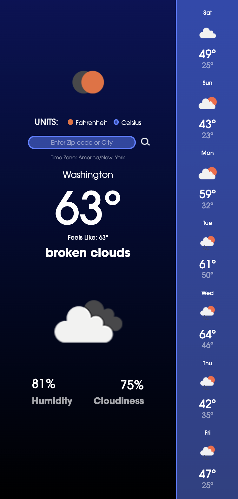
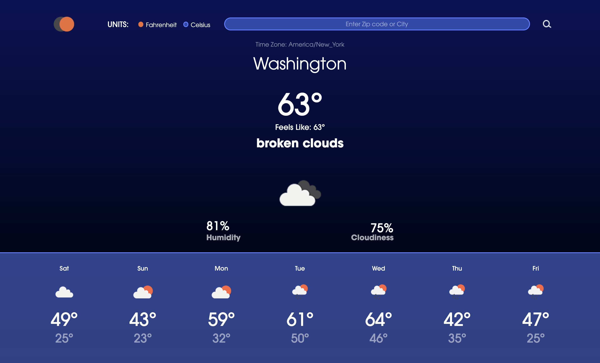

# Eclypse - Weather App

A simple weather app with 7 day forecast and the option to choose between imperial or metric units. This project was created to exercise my ability to use APIs and JavaScript skills.

## APIs Used
- [Google Geocoding API](https://developers.google.com/maps/documentation/geocoding/overview)
- [OpenWeatherMap - One Call API](https://openweathermap.org/api/one-call-api)

## Resources Used in My Process
- [CSS Gradient — Generator, Maker, and Background](https://cssgradient.io/)
- [Pure CSS Custom Styled Radio Buttons | Modern CSS Solutions](https://moderncss.dev/pure-css-custom-styled-radio-buttons/)
- [PX to percentage converter (instantly and bidirectional)](https://nekocalc.com/px-to-percentage-converter)
- [JavaScript Date getDay() Method](https://www.w3schools.com/jsref/jsref_getday.asp)

## Link to LIVE APP

